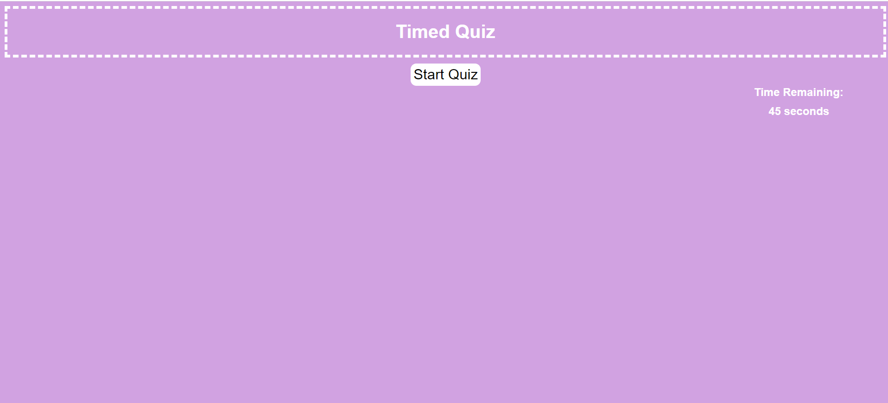
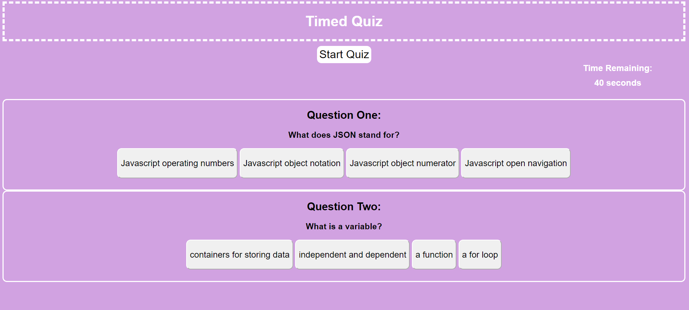

# Timed Quiz

## Description
For this project, I was required to create a timed quiz. Once the user clicks on the start button, the timer will start to decrease. The timer will decrease when the user clicks on the incorrect answer. Once the correct answer is clicked, the next question will show up on the screen. The user's score will increase if the correct answer is clicked and decrease if the incorrect value is clicked. The quiz will end once the user answers the fourth question correctly, and then they can input their score and initials. The quiz will also end once the timer reaches zero and an alert will appear on the screen. 

### Skills
* Timer Intervals
* Local Storage
* On Click Events 
* JQuery 

#### Links and Screenshot 
https://github.com/danille-l-perry95/timed-quiz
https://danielle-l-perry95.githubio/timed-quiz

